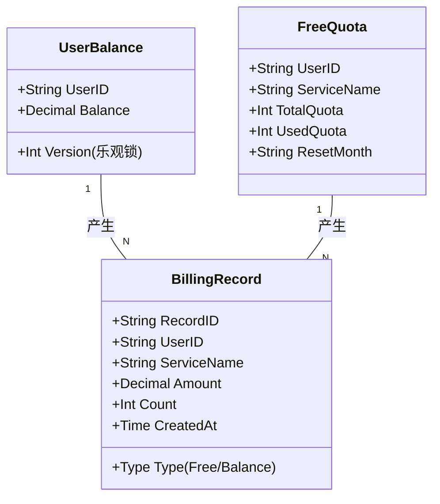
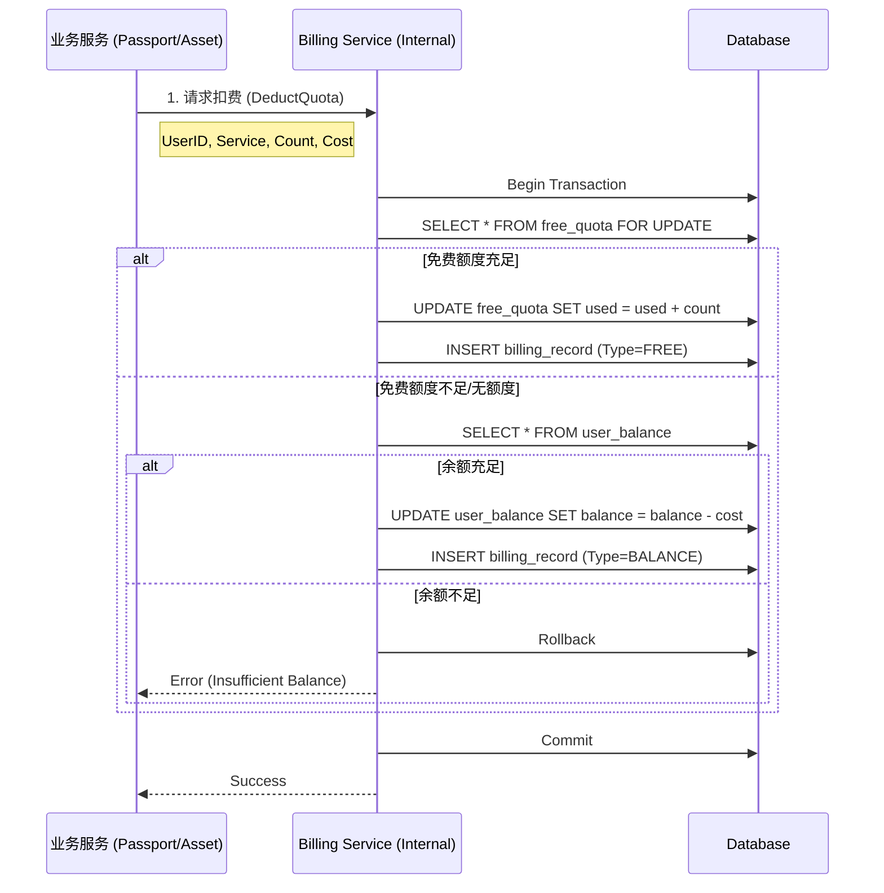
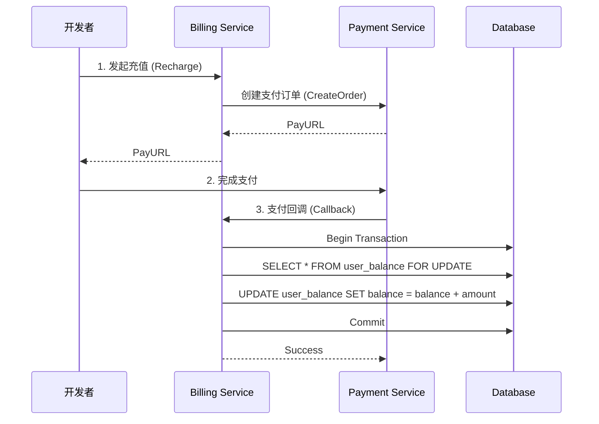
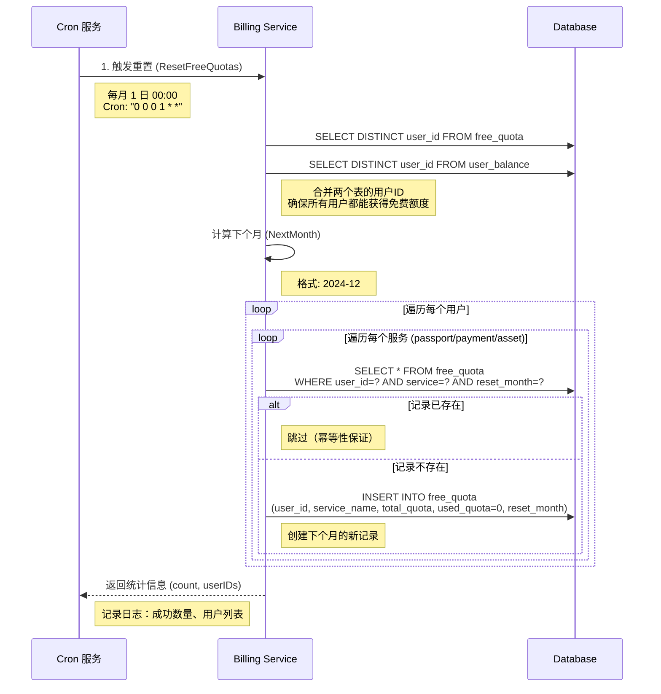

# Billing Service 业务逻辑设计

本文档通过 UML 图表展示 `billing-service` 的核心业务逻辑和流程。

## 1. 核心领域模型 (Domain Model)

展示核心实体 `UserBalance`, `FreeQuota`, `BillingRecord` 及其关系。

**设计说明**：
- **混合支付**：用户同时拥有免费额度（FreeQuota）和余额（UserBalance）。
- **流水记录**：每次扣费（无论是扣额度还是扣余额）都会生成 BillingRecord。

## 2. 配额检查与扣减流程 (Check & Deduct)

展示业务服务调用本服务进行扣费的核心逻辑（优先抵扣免费额度）。

## 3. 充值流程 (Recharge)

展示用户充值的全流程，包括与 Payment Service 的交互。

## 4. 免费额度重置流程 (Quota Reset)

展示每月 1 日自动重置免费额度的逻辑。

**设计说明**：
- **执行时间**：每月 1 日 00:00 自动执行（Cron 表达式：`0 0 0 1 * *`）
- **用户获取策略**：从 `free_quota` 和 `user_balance` 两个表获取所有用户ID，确保：
  - 已有免费额度记录的用户能获得下个月的额度
  - 只有余额但还没有免费额度记录的新用户也能获得免费额度
- **幂等性保证**：如果下个月的记录已存在，自动跳过，避免重复创建
- **错误处理**：单个用户或服务的失败不影响其他用户，记录警告日志后继续处理
- **性能考虑**：使用批量查询和事务，支持大量用户的场景
